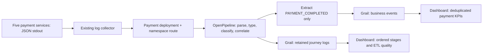

# Payments — Activity, Outcomes & Journey

Grail dashboard and OpenPipeline setup for the existing `payments-demo` Helm release in `llm-obs-demo`. No application rebuild, new service, or change to `otel-demo` is required.

**Status:** local implementation and tests complete; tenant deployment, native dashboard validation, DQL execution, and OpenPipeline preview remain pending. No authenticated Dynatrace connection was available. The JSON follows the documented version-21 format and passes a locally encoded subset schema; this is not full vendor-schema validation.

Start with [installation](install.md), then use the [six-minute presenter guide](presenter.md).

| File | Purpose |
| --- | --- |
| [payments-dashboard.json](payments-dashboard.json) | Raw dashboard JSON for the current Dashboards app |
| [payments-final-log-fallback.json](payments-final-log-fallback.json) | Equivalent KPI counting from normalized final logs if extraction is unavailable |
| [payments-dashboard.document.json](payments-dashboard.document.json) | Separate document envelope with name/type/content; **not** the UI upload file |
| [openpipeline/ui-configuration.json](openpipeline/ui-configuration.json) | Exact ordered UI checklist, matchers, processing file references, extraction fields; **not** a Settings API payload |
| [queries/index.json](queries/index.json) | Every primary DQL query labelled by purpose, data source, and timeframe |
| [queries/fallback-index.json](queries/fallback-index.json) | Fallback dashboard queries |
| [data-contract.md](data-contract.md), [field-mapping.json](field-mapping.json) | Types, mapping, classification, deduplication, and counting rules |
| [../../scripts/demo-payments-dashboard.py](../../scripts/demo-payments-dashboard.py) | Existing-generator walkthrough driver with observed failure-location coverage |
| [validation/results.json](validation/results.json), [validation/README.md](validation/README.md) | Reproducible local evidence and explicit remaining live checks |
| [fixtures/](fixtures/) | Actual local service logs/responses and clearly labelled reference projections |
| [sources.md](sources.md) | Official capability references checked 2026-10-07 |



Business KPIs count one authoritative final outcome per transaction. Intermediate success is never payment success. Stage timing is exclusive local processing; end-to-end timing comes only from the final record. The default slow threshold is three seconds, explicitly a demo threshold.

To regenerate all managed JSON/DQL after changing `build.py`:

```bash
python3 observability/payments/build.py
python3 -m pip install -r observability/payments/validation/requirements.txt
python3 observability/payments/validation/validate.py
```

Changes to the generator must be regenerated before committing. The validation script uses saved fixtures; it does not contact Dynatrace or create traffic.
